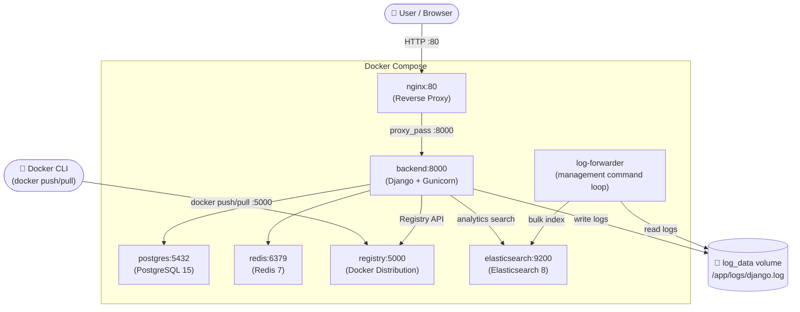
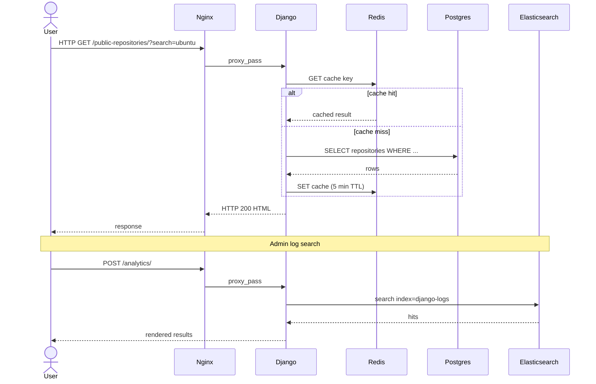
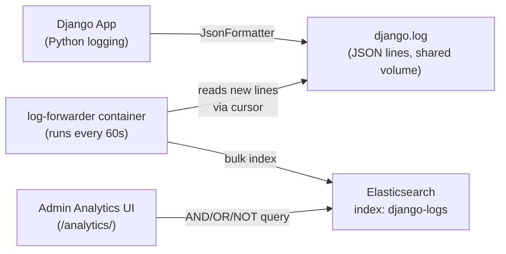
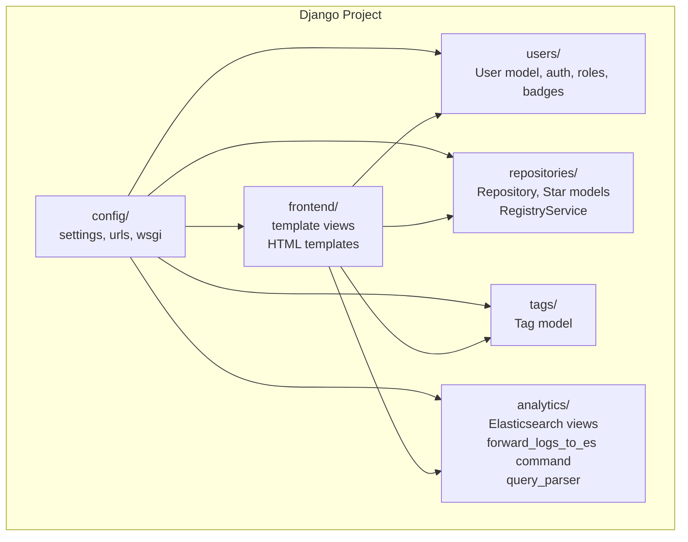
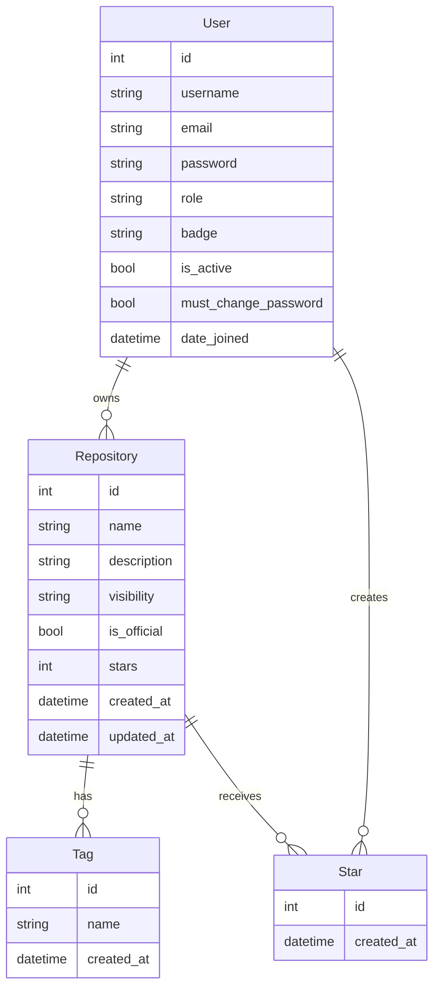
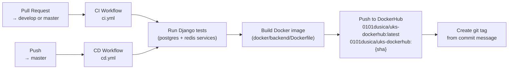

# Architecture Overview

## System Description

The application is a simplified DockerHub clone built as a multi-container system. It allows users to manage Docker image repositories, push images to a self-hosted registry, and gives administrators tools to manage users, official repositories, and analyze system logs.

The system is composed of 7 Docker services orchestrated via Docker Compose.

---

## Container Architecture

---

## Request Flow

---

## Log Pipeline

---

## Django Application Structure

---

## Services Summary

| Service | Image | Port | Purpose |
|---|---|---|---|
| **backend** | custom (Python 3.12-slim) | 8000 (internal) | Django application served by Gunicorn |
| **nginx** | custom (nginx:alpine) | 80 | Reverse proxy, serves static files |
| **postgres** | postgres:15 | 5432 | Primary relational database |
| **redis** | redis:7 | 6379 | Response cache (5 min TTL on public repos) |
| **registry** | registry:2 | 5000 | Self-hosted Docker image registry |
| **elasticsearch** | elasticsearch:8.11.1 | 9200 | Log storage and full-text search |
| **log-forwarder** | custom (same as backend) | - | Reads django.log, bulk-indexes to ES every 60s |

---

## Data Model

---

## User Roles

| Role | Capabilities |
|---|---|
| **Unauthenticated** | Browse and search public repositories |
| **User** | + Create/edit/delete own repositories, manage tags, star repositories |
| **Admin** | + Manage users (block/unblock, assign badges), manage official repositories, view analytics logs |
| **Superadmin** | + Create admins, block/unblock admins. Auto-created on first startup with a generated password. |

---

## CI/CD Pipeline

